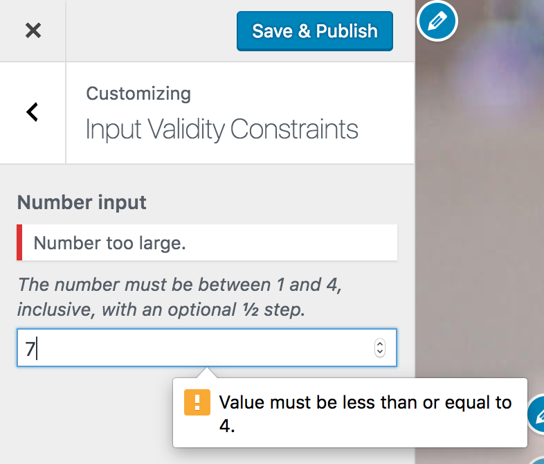

<!-- DO NOT EDIT THIS FILE; it is auto-generated from readme.txt -->
# Customize Input Validity Constraints

Enforce HTML5 validity constraints via setting validation by looking at associated controls and their type and input_attrs. Feature plugin for #38845

**Contributors:** [xwp](https://profiles.wordpress.org/xwp), [westonruter](https://profiles.wordpress.org/westonruter)  
**Tags:** [customizer](https://wordpress.org/plugins/tags/customizer), [customize](https://wordpress.org/plugins/tags/customize)  
**Requires at least:** 4.7-beta4  
**Tested up to:** 4.7-beta4  
**Stable tag:** 0.1.0  
**License:** [GPLv2 or later](http://www.gnu.org/licenses/gpl-2.0.html)  

 

## Description ##

This is a feature plugin intended to implement [#38845](https://core.trac.wordpress.org/ticket/38845): Implement HTML5 input validity constraints in customizer settings. Read the writeup in the [ticket description](https://core.trac.wordpress.org/ticket/38845#comment:description).

Activate the bundled “Customize Input Validity Constraints Examples” plugin to see the functionality in action.

**Development of this plugin is done [on GitHub](https://github.com/xwp/wp-customize-input-validity-constraints). Pull requests welcome. Please see [issues](https://github.com/xwp/wp-customize-input-validity-constraints/issues) reported.**

## Screenshots ##

### Server-side and client-side validation is performed.

## Changelog ##

### 0.1.0 ###
Initial release.

